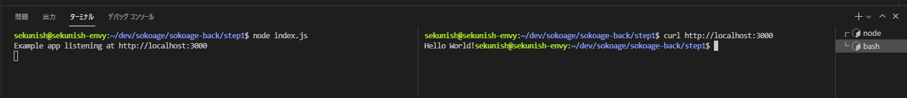

# バックエンド座学

## 用語

* REST API

    https://tsuyopon.xyz/2019/01/31/understand-4-http-methods/

* マイクロフレームワーク

    https://anken-hyouban.com/blog/2020/12/17/micro-framework/  

    1. 軽量（マイクロ）
    2. シンプルで自由度が高い
    3. 学習コストが低い

* ハンドラー

    https://nablarch.github.io/docs/LATEST/doc/application_framework/application_framework/nablarch/architecture.html

## chapter1 express

* WEBアプリケーションフレームワーク「express」

    https://qiita.com/nkjm/items/723990c518acfee6e473


    * 取得イメージ

    https ://your.hostname.com/api/user/actionID  

    ↓  
    
    https ://your.hostname.com/api/user/abc0001  

    ↓  

    作成するソースのイメージ  
    ```javascript
    // 任意のユーザー情報を提供するAPI
    app.get("/api/user/:userId", function(req, res, next){
        // req.params.photoIdでユーザー情報を取得する
        console.log(req.params.userId);
    });
    ```

## chapter2 チュートリアル

* 公式チュートリアル

    https://expressjs.com/ja/


    1. インストール & Hello World


        * vscodeでstep1ディレクトリを開く

        * 関連モジュールをインストールする

            > npm install

        * コンソールを２つ開く

            

        * 1つ目のコンソールで下記コマンドを実行する

            > node index.js

        * 2つ目のコンソールで下記コマンドを実行する

            > curl http://localhost:3000

            * これはブラウザで http://localhost:3000 にアクセスしているのと同じ.コンソールからアクセスしているだけ.

            * ブラウザから試しにアクセスしてみてOK

    2. Experss ジェネレーター
        * 紹介のみ
        * step2 はこのジェネレーターで作成したものをベースにしている
    
    3. 基本的なルーティング

        * vscodeでstep1ディレクトリを開く

        * 関連モジュールをインストールする

            > npm install

        * コンソールを２つ開く

            

        * 1つ目のコンソールで下記コマンドを実行する

            > npm run start

        * 2つ目のコンソールで下記コマンドを実行する

            > curl http://localhost:3000/users/100 -XGET

            > curl http://localhost:3000/users/100 -XPOST

            > curl http://localhost:3000/users/100 -XPUT

            > curl http://localhost:3000/users/100 -XDELETE
        
## chapter3 ガイド

* ルーティング

    * route メソッド

    * app.all

    * ルート・ハンドラー

        * 演習あり

    * レスポンスメソッド

* エラー処理

* データベースの統合